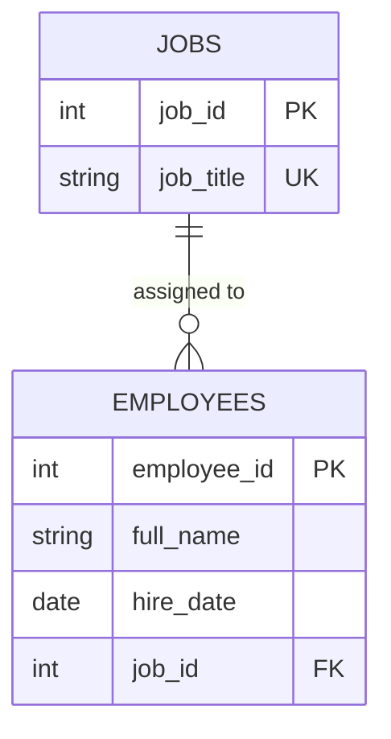

# Paper Lantern Studio - Database Journey

A small game-studio simulation used to learn PostgreSQL step by step.
The studio starts with three founders and grows phase by phase.
Each phase adds or reshapes tables.

## Run it

1. Copy `.env.example` to `.env` and set your own password.
2. Start the server: `docker compose up -d`
3. Apply a phase: `docker exec -i company-postgres psql -U company_user -d company_db < phase1/01_create_employees.sql`

## Phases

- **Phase 1 - Founding:** a single `employees` table with three founders.
- **Phase 2 - Jobs:** job titles move out of `employees` into a `jobs` table, linked by a foreign key.

